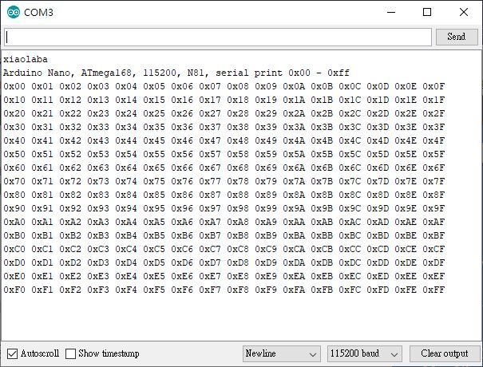

# ATmege168P_USART_dump_0x00_0xFF

C code only

uses ARduino IDE or direct avr-gcc to compile, both ok

115200, N81

### how it works
```
  short i; // counter from 00 to 0xff
  for (i = 0; i <=0xff; i++) {
    usart_printhex(i);  // dump counter value, display as HEX
    usart_putchar(' '); // space for next counter value and visual easy
    if ((i & 0x0f) == 0x0f){ usart_putchar('\n');}  // fromat the display every 16th, change to new line
```


result  



### compile and batch file
set the soruce code as 'main'
```
set main=usart_print0xff.ino
```

compiler option, specify .ino rather than general .c
```
avr-gcc.exe -xc -Os -mmcu=at%mcu% -Wall -g -o %main%.out *.ino
```


complete batch file

```
@echo off


::set mcu=mega324p
set mcu=mega168p

set main=usart_print0xff.ino
set ac=C:\WinAVR-20100110

path %ac%\bin;%ac%\utils\bin;%path%

avr-gcc.exe -dumpversion
avr-gcc.exe -xc -Os -mmcu=at%mcu% -Wall -g -o %main%.out *.ino

::avr-gcc.exe -O2 -Wl,-Map,%1.map -o %1.out %1.c %2 %3 -mmcu=at%mcu%
cmd /c avr-objdump.exe -h -S %main%.out >%main%.lst
cmd /c avr-objcopy.exe -O ihex %main%.out %main%.hex
avr-size.exe %main%.out
del %main%.out

::goto end
::pboot.exe -c1 -b19200 -p%main%.hex
::l.exe -b9600
:end

```
